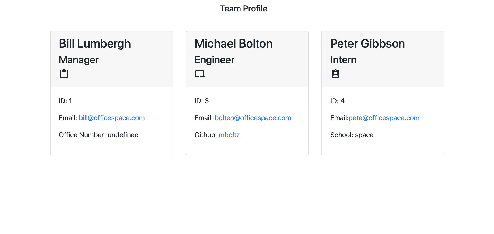

# Team-Profile-Gen-hw

## Description

This command line application was generated to help a user create a quick reference for their team. The application generates an HTML file where the user would has access to see their information. The cards include employeer information for name, email and comapny ID. Then each role (Manager, Intern and Engineer) has individualized information that pertains to their job. Teh card is generated with this name and role at the top of the card and their information below. The application utilized the command line in the terminal to ask the user prompts and the user simply has to answer the prompts and an HTML will be gernerated. The user can determine how many employees they want to include on eact team.

## Installation

In order to use this application the user must have a terminal or git bash. The Code is currently running in VS code so that is recommended. Addtionally, the user will have to install npm and npm inquirer to be able to execute the command line code.
link to deployed page: https://adrianauch.github.io/Team-Profile-Gen-hw/

## Usage

Please watch the following video demonstration:

https://user-images.githubusercontent.com/87041736/130884233-66ef6d0a-4970-46a6-94dd-e39e60f6c2ac.mov

https://user-images.githubusercontent.com/87041736/130884330-84a4b47b-6ef0-4e4a-bc3b-1a2820069933.mov

Steps:

1. run node index.js
2. answer the prompts (repsond y/n based off how employees you would like to add to the team)
3. When you are done adding team members answer the last prompt with an n
4. You HTML file with the cards will then be generated in the HTML folder
5. You can open the HTML in the browser to see the cards.

The final Product should look like this:

## License

## Credits

I would like to thank my Tutor Lawrence for helping me work through my homework and some of its challenges. Additonally, the application utilized font awesome, google fonts and bootstrap.

### Conact Me:

if you would like to contact me about my project such as bugfixes or have any questions please email me at adrian.auch11@gmail.com. Also check out my github: https://github.com/adrianauch.
